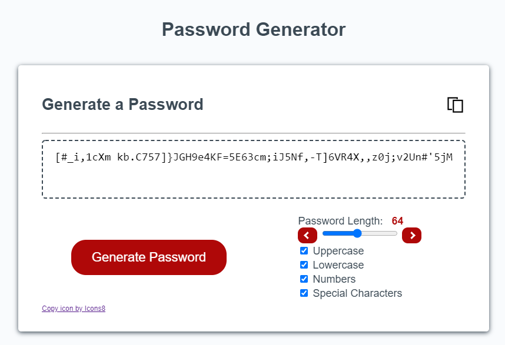

# Password Generator

Generates a random password based on the requirements of the user.

## Options
1) Password length between and inclusive of 8 and 128
2) Choice of character types:
    * Uppercase letters
    * Lowercase letters
    * Numbers
    * Special characters

## Copy to clipboard icon
Allows the user to copy the password directly to the clipboard for use in a password field.

